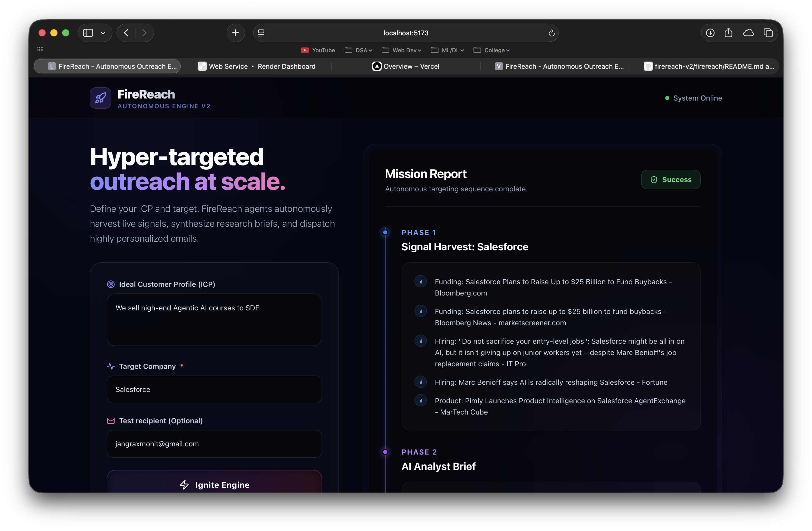
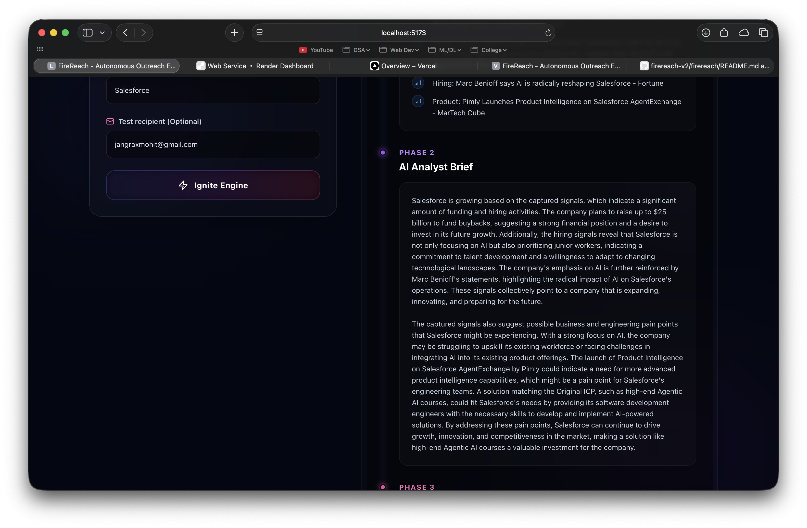
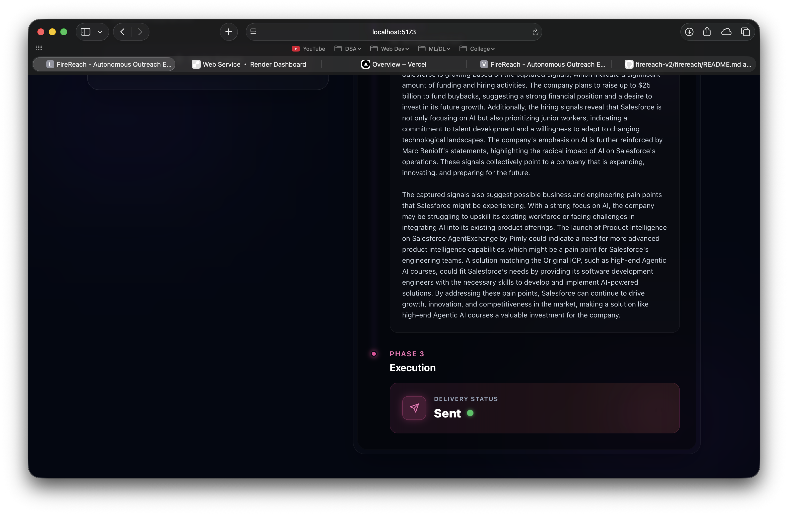
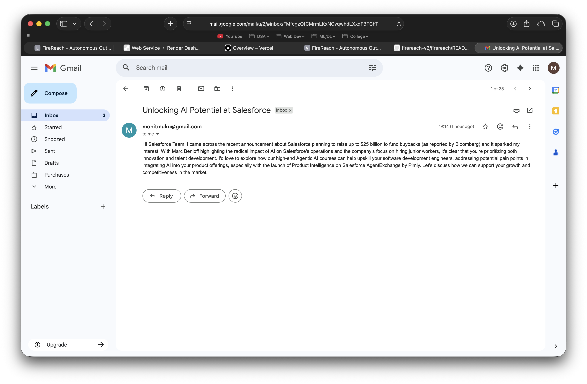

# FireReach - Autonomous AI Outreach Engine 🚀

FireReach is a powerful, autonomous AI Sales Development Representative (SDR) system. It transforms a simple prompt (Ideal Customer Profile - ICP) into a fully automated outreach campaign: discovering target companies, harvesting real-time growth signals, synthesizing strategic account briefs, and dispatching hyper-personalized emails.

## 🌐 Live Application
- **Frontend (Dashboard):** [Live on Vercel](https://firereach-v2.vercel.app)
- **Backend (API):** [Live on Render](https://firereach-v2.onrender.com)

---

## 📸 Dashboard Preview

**Autonomous Dashboard Overview**


**Real-Time Signal Discovery**


**AI-Generated Research & Outreach**


**Personalized Execution**


---

## ✨ Features
- **Autonomous Prospecting:** Discovers relevant companies via DuckDuckGo based on your ICP.
- **Growth Signal Harvesting:** Scrapes live signals (news, hiring, expansion) for maximum context.
- **Smart Analysis:** Uses Groq (Llama 3) to generate strategic two-paragraph research briefs.
- **Personalized Delivery:** Drafts and sends hyper-personalized outreach via SendGrid/SMTP.
- **Premium UI:** A high-performance, responsive React dashboard built with Vite.

## 🛠️ Tech Stack
- **Frontend:** React, Vite, Tailwind CSS, Lucide Icons
- **Backend:** Python, FastAPI, Contextual AI Agents
- **AI Engine:** Groq (Llama 3 70B)
- **Deployment:** Vercel (Frontend), Render (Backend)

---

## 🚀 Local Development

### 1. Backend (FastAPI)
1. `cd firereach/backend`
2. `pip install -r requirements.txt`
3. Configure `.env` with `GROQ_API_KEY` and `SMTP` credentials.
4. `uvicorn app.main:app --reload --host 0.0.0.0 --port 10000`

### 2. Frontend (React / Vite)
1. `cd firereach/frontend`
2. `npm install`
3. `npm run dev`

---

## ⚙️ Environment Variables
Required in your backend `.env` file:
```env
GROQ_API_KEY=your_key
SMTP_SERVER=smtp.gmail.com
SMTP_PORT=587
SMTP_USERNAME=your_email
SMTP_PASSWORD=your_app_password
SENDER_EMAIL=your_email
```

## 📖 Documentation
For a deep dive into the agentic workflows, system prompts, and tool schemas, visit:
👉 [**Full System Documentation**](./firereach/DOCS.md)
